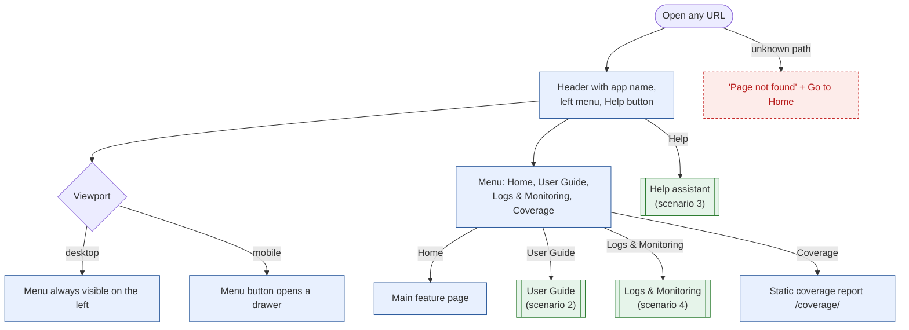

# 1. App Shell & Navigation

Every page shares the header, the left menu and the floating Help button.

```mermaid
flowchart TD
  open(["Open any URL"]) --> shell["Header with app name,<br/>left menu, Help button"]
  shell --> viewport{"Viewport"}
  viewport -->|"desktop"| permanent["Menu always visible on the left"]
  viewport -->|"mobile"| drawer["Menu button opens a drawer"]
  shell --> menu["Menu: Home, User Guide,<br/>Logs & Monitoring, Coverage"]
  menu -->|"Home"| home["Main feature page"]
  menu -->|"User Guide"| guide[["User Guide<br/>(scenario 2)"]]
  menu -->|"Logs & Monitoring"| logs[["Logs & Monitoring<br/>(scenario 4)"]]
  menu -->|"Coverage"| coverage["Static coverage report /coverage/"]
  shell -->|"Help"| help[["Help assistant<br/>(scenario 3)"]]
  open -->|"unknown path"| notFound["'Page not found' + Go to Home"]

  classDef screen fill:#e8f0fe,stroke:#2f5d9e
  classDef hidden fill:#fdecea,stroke:#c62828,stroke-dasharray:4 3,color:#b71c1c
  classDef link fill:#e6f4ea,stroke:#2e7d32
  class shell,permanent,drawer,menu,home,coverage screen
  class notFound hidden
  class guide,logs,help link

  %% link guide 02-user-guide.md
  %% link logs 04-logs-monitoring.md
  %% link help 03-help-assistant.md

  %% guide 01-getting-started.md
```
