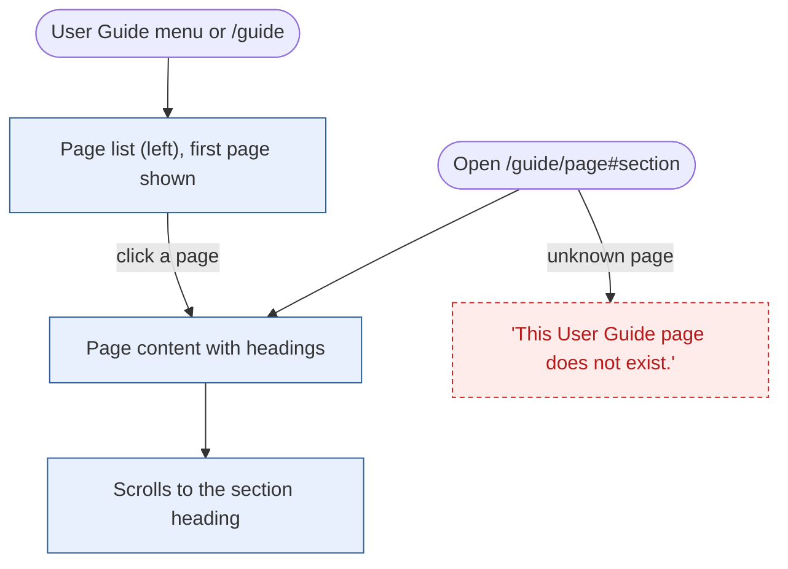

# 2. User Guide

The User Guide pages are the Markdown files in `docs/user-guide/`. The same files are indexed for
the Help assistant, so a chatbot source link opens the exact section here.

```mermaid
flowchart TD
  enter(["User Guide menu or /guide"]) --> list["Page list (left), first page shown"]
  list -->|"click a page"| page["Page content with headings"]
  deep(["Open /guide/page#section"]) --> page
  page --> anchor["Scrolls to the section heading"]
  deep -->|"unknown page"| missing["'This User Guide page does not exist.'"]

  classDef screen fill:#e8f0fe,stroke:#2f5d9e
  classDef hidden fill:#fdecea,stroke:#c62828,stroke-dasharray:4 3,color:#b71c1c
  class list,page,anchor screen
  class missing hidden

  %% guide 01-getting-started.md
```
